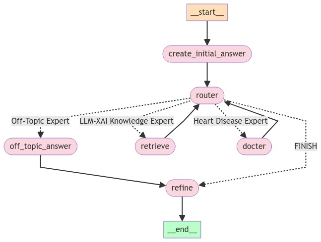
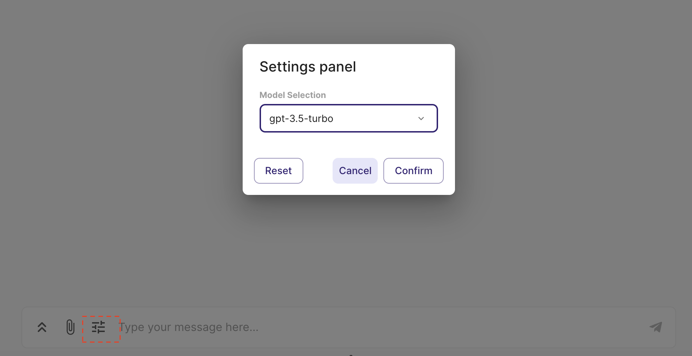
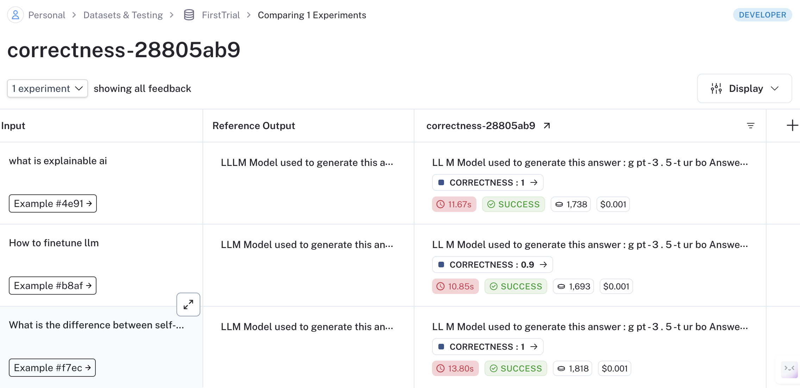
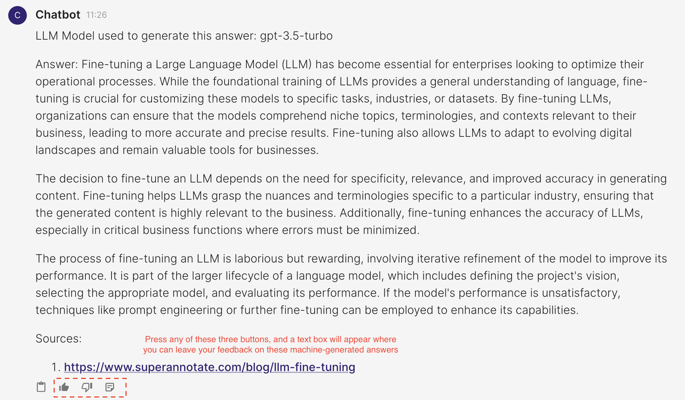
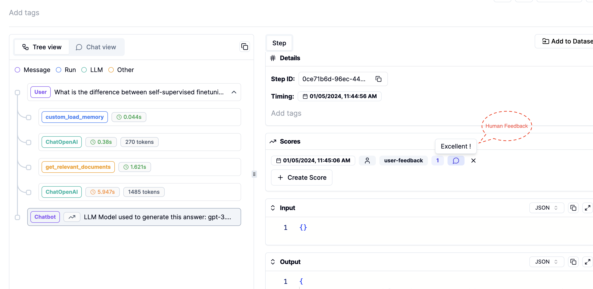
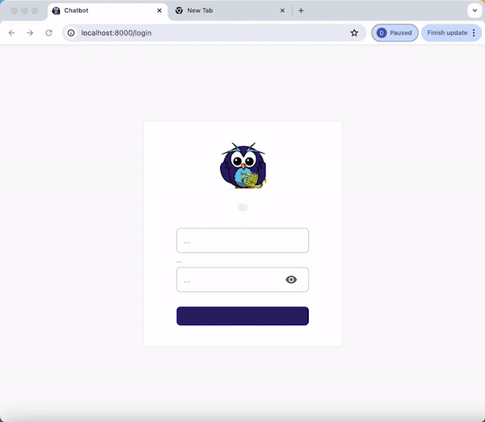

## Workflow


This is my third version of using LangChain to implement a QA chatbot. The advantage is that it has the benefit of the router chain and agent; you can define your workflow, and you can use a node as a supervisor to decide if it needs the skills or knowledge of other nodes. These nodes function similarly to experts with specific expertise (e.g., proficiency in LLM fine-tuning or medical knowledge).

The disadvantage is that it takes longer because you have to return the intermediate result to the supervisor node, which then decides whether to stop using any more experts or continue with appropriate ones. 

To better utilize chat memory, I use an LLM node to generate the initial answer. For example, if the first question is "What is explainable AI?" and the next question is "Why is it important?", the supervisor node may mistakenly consider the latter as off-topic and redirect it to the Off-Topic Handler. However, an LLM equipped with chat memory and without awareness of our topics can generate an initial answer containing keywords like "explainable AI." When the supervisor node sees the question and the initial answer, it will recognize the relevance of the question to our topics.

The final refine node uses an LLM to maintain the desired format and merge intermediate answers. 

To prevent the supervisor node from getting stuck by using the same expert repeatedly, I enforce a rule that it can only use the same expert once. If a question is regarded as off-topic, the supervisor doesn't need to make a decision again.

## Environment Setup
1. **Create and activate a Conda environment**:
    ```bash
    conda create -y -n chatbot python=3.11
    conda activate chatbot
    ```
2. **Install required packages**:
    ```bash
    pip install -r requirements.txt
    ```
3. **Set up environment variables**:
    - Write your `OPENAI_API_KEY` in the `.env` file. A template can be found in `.env.example`. 
    ```bash
    source .env
    ```
## Running the Application
To start the application, use the following command:

```bash
chainlit run app.py
```

## Features

### User Setting Panel
Users have the option to select the specific LLM (language learning model) they prefer for generating responses. The switch between different LLMs can be accomplished within a single conversation session.




### QA with RAG
- **Various Information Source**: The chatbot can retrieve information from web pages, YouTube videos, and PDFs.
- **Source Display**: You can view the source of the information at the end of each answer.
- **LLM Model Identification**:  The specific LLM model utilized for generating the current response is indicated.
- **Router retriever**: Easy to adapt to different domains, as each domain can be equipped with a different retriever.

### Conversation Memory
- **Memory Management**: The chatbot is equipped with a conversation memory feature. If the memory exceeds 500 tokens, it is automatically summarized.

### Langsmith Evaluation

To evaluate model generation against human references or log outputs for specific test queries, use Langsmith.

1. Register an account at [Langsmith](https://smith.langchain.com/).
2. Add your `LANGCHAIN_API_KEY` to the `.env` file.
3. Execute the script with your dataset name: 
   ```bash
   python langsmith_tract.py --dataset_name <YOUR DATASET NAME>
   ```
4. Modify the data path in `langsmith_evaluation/config.toml` if necessary (e.g., path to a CSV file with question and answer pairs).


### Recording Human Feedback with Literal AI
Use Literal AI to record human feedback for each generated answer. Follow these steps:

1. Register an account at [Literal AI](https://cloud.getliteral.ai/).
2. Add your `LITERAL_API_KEY` to the `.env` file.
3. Once the `LITERAL_API_KEY` is added to your environment, run the command `chainlit run app.py`. You will see three new icons as shown in the image below, where you can leave feedback on the generated answers.



4. Track this human feedback in your Literal AI account. You can also view the prompts or intermediate steps used to generate these answers.



### User Authentication and User Past Chat Setup

This guide details the steps for setting up user authentication in your application. Each authenticated user will have the ability to view their own past interactions with the chatbot.

1. Add your APP_LOGIN_USERNAME and APP_LOGIN_PASSWORD to the `.env` file.
2. Run the following command to create a secret which is essential for securing user sessions:
   ```bash
   chainlit create-secret
   ```
   Copy the outputted CHAINLIT_AUTH_SECRET and add it to your .env file
3. Once you launch your application, you will see a login authentication page
4. Login with your APP_LOGIN_USERNAME and APP_LOGIN_PASSWORD
5. Upon successful login, each user will be directed to a page displaying their personal chat history with the chatbot.




## Presentation

Below is a preview of the web interface for the chatbot:


## Configuration

To customize the chatbot according to your needs, define your configurations in the `config.toml` file and `tool_configs.toml` where you can define the name and descriptions of your tools.


